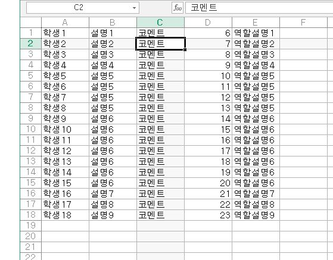

# one_student_one_role_randomizer(1인1역 기록장)

## 소개
간단한 1인 1역 기록장, 사실 역할 렌덤화로 하려고 했지만, 어쩌다 보니 기록장으로 바뀌게됨

## 기능
- **기록 역할**: 기록장인 만큼 학생의 역할에 따른 코멘트와 평점을 남길수 있고, 전체 글 수를 길이, 바이트로 알 수 있습니다.

- **CSV 임포트, 익스포트**: CSV 파일로 가저오거나 내보낼수 있습니다. (셀로 만들때 무조건 A1부터 이름,역할,학생 코멘트,점수,역할 설명 순으로 행 방향으로 적어야합니다.)

## 계획
- **자동 업데이트**: 깃헙에 올라온 릴리즈를 자동으로 다운받는 기능을 추가한다.
- **로깅 추가**: 디버깅을 편하게 하기위해 로깅 기능을 추가한다.

사실 계획은 안할 가능성이 큼.

2024-7-8
